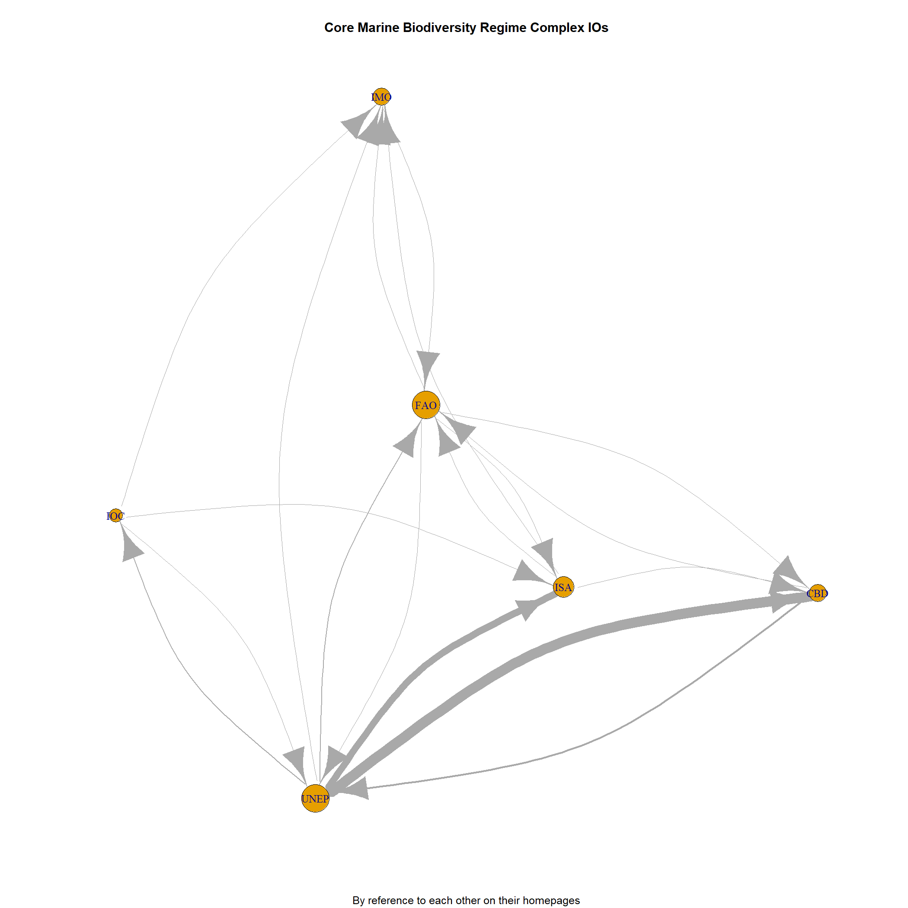
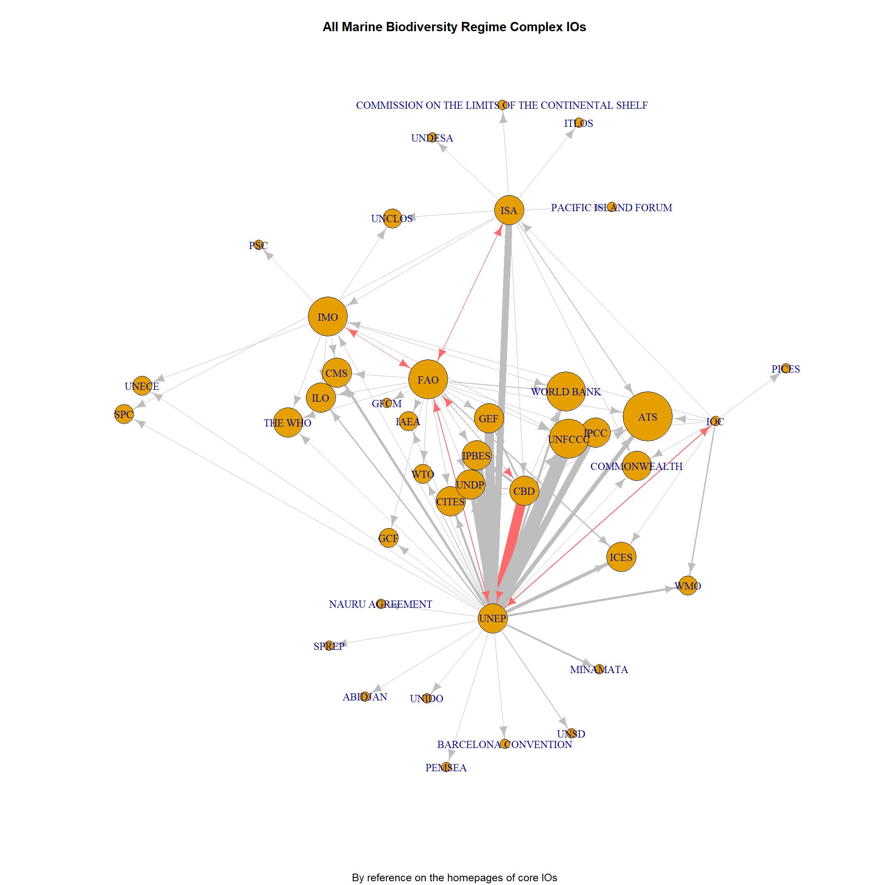
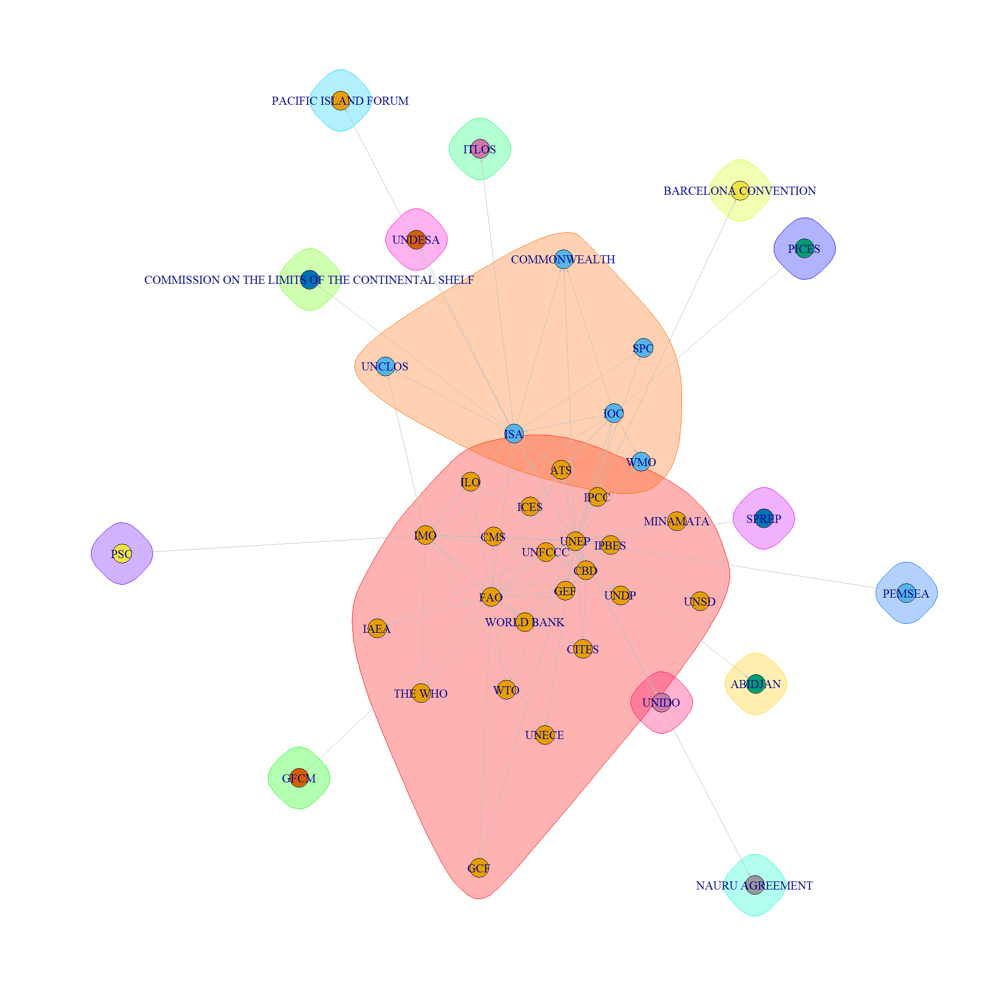

```{r setup, include=FALSE}
knitr::opts_chunk$set(echo = TRUE)
knitr::opts_chunk$set(fig.pos = 'H')


library(tidyverse, quietly = TRUE)
require(ggthemes)
require(kableExtra)
require(gridExtra)
require(scales)
require(reshape2)
require(MikTeX)
library(tinytex)
library(countrycode)
library(bookdown)
library(ggplot2)
library(plyr)


source("io_cooperation.R")

df <- data.frame(names = c(rownames(df_cbd), rownames(df_fao), rownames(df_imo), rownames(df_ioc), rownames(df_isa), rownames(df_unep)), 
 ref =  c(df_cbd$cbd, df_fao$fao, df_imo$imo, df_ioc$ioc, df_isa$isa, df_unep$unep)
)

df <- filter(df, ref != 0)


```

## The Structure of the Marine Biodiversity Regime Complex.
A regime complex is an array of partially overlapping and non-hierarchical institutions governing a particular issue-area’ [@RN16, p. 279]. The particular issue-area in this case is "marine biodiversity governance" and institutions are international organizations (IOs) that overlap and interact with each other in governing marine biodiversity. Marine biodiversity as a policy issue touches upon very different competences of international organizations. For example: The governance of (terrestrial) biodiversity is the mandate of the Convention of Biological Diversity (CBD). International environmental issues fall under the tasks of the UN Environmental Program (UNEP). Shipping is regulated by the International Maritime Organization (IMO). The use of fish as a food resource is governed by the Food and Agriculture Organization (FAO). The regulation of exploration and exploitation of resources from the ocean floor (seabed) is the competence of the International Seabed Authority (ISA). And finally, the International Oceanographic Commission (IOC) facilitates and organizes international oceanic research and related data exchange. Because of the direct interlinkages between the mandates of these IOs and the policy area of marine biodiversity, we identified these IOs as core of the international marine biodiversity regime complex. 

In this project I set out to explore how International Organizations (IOs) within the regime complex cooperate with each other, to depict the governance network and give insights into the cooperation patterns taking place within the regime complex and the positions of individual IOs. With the help of this knowledge, it is hoped to explain how the regime complex works and could work.


## Data collection
In order to collect data on the cooperation between IOs, I collected data from the websites of the `r length(io)` IOs (`r print(io)`) that we identified as core to the marine biodiversity regime complex. Each IO informs the public and their constituents (states) about their activity and with whom their cooperate in order to govern the policy area they are assigned to and fulfill their mandate. To do so, each IO has a tab on their website called "news" or "briefings" etc. through which they communicate publicly and regularly. I used the bing api to create a list of urls with the potentially last 5000 publications under the "news" section. Every IO however had less than this maximum number of news publicly available. 

Using this url list, I scraped the news pages of the IOs using the rvest package within the R programming language. In this way, I created a database containg 1) the url, 2) the title of the news piece, 3) the links to other urls within the page and 4) the whole text of the news piece. In a subsequent step, the links and the texts of each news page were scanned for references to other IOs. In this way, a relational matrix of references between the `r length(io)` core IOs and from the core IOs to other potentially relevant IOs was created.

## Data description
The dataset contains data from `r nrow(url_list_total)` individual news pages containing `r sum(df$ref)` references to to `r length(unique(df$names))` different IOs. This indicates that IOs do use the news section of their websites to refer to each other. 


# Results
## CORE IOs
We see that the core IOs do frequently and intensively refer to each other. The size of the circle indicates the degree, meaning the number of connections that IO has. 

UNEP, the FAO and the ISA are the most central IOs. UNEP is particularly active in referring to the CBD and the ISA. IOC is less connected. Only UNEP refers to the IOC. On the other hand, the FAO is the most referred to in terms of individual IOs.
```{r pressure, echo=FALSE, fig.cap="Core IOs", out.width = '100%'}

```
This means that within the previously identified core IOs, UNEP, the FAO and the ISA are best connected in the cooperation network. If we differentiate further, we see that UNEP indicates very close links to the CBD and the ISA, whereas the FAO is mentioned by the most other IOs. This indicates that UNEP actively aims to establish cooperation with many other IOs, and that many IOs aim to establish cooperation with the FAO.  


## Whole Regime Complex
If we extend the sample of references to all the IOs that we identified, it becomes clear that the core IOs not only refer to each other but also to many other IOs that are identified as potentially playing a role within the marine biodiverstiy regime complex. Red links indicate mutual ties and grey links unidirectional. The size of the circles indicates the degree of incoming ties - the amount of connections from other IOs to the IO at hand. 
```{r, echo=FALSE, fig.cap="All IOs", out.width = '100%'}

```

Again we see the central role of UNEP which is very active in mentioning others but is not particularly strongly mentioned by others. Interestingly, the most mentioned IOs are the ATS (Antarctic Treaty System), UNFCCC (UN Framework Convention on Climate Change) and the World Bank.


## Communities 

```{r, echo=FALSE, fig.cap="Communities", out.width = '100%'}

```

# References  

